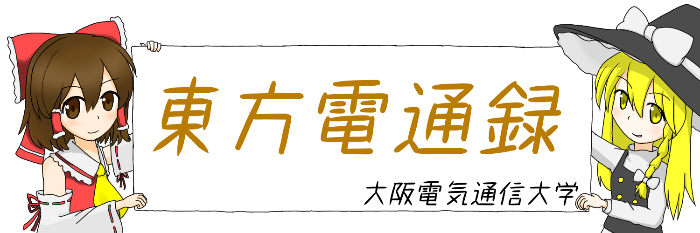
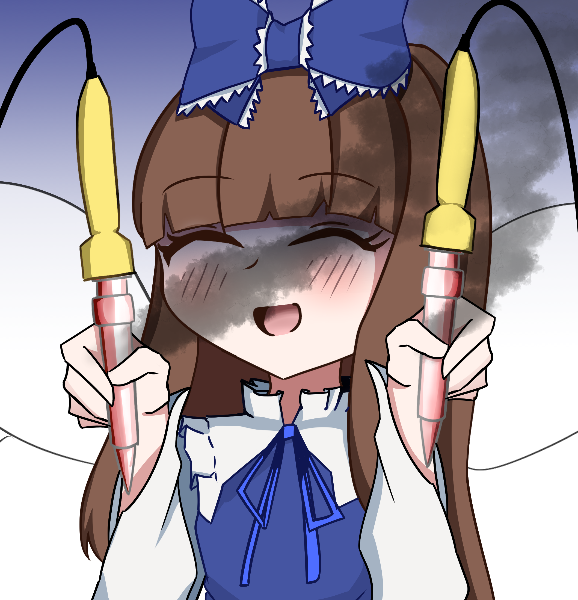

<h2>はじめに</h2>

※このリポジトリは、我々「東方電通録」制作のゲーム 『東方妖蒼玉』 のオープンソース版です。
ゲーム制作や学習の参考として、自由に活用していただければ幸いです。

本プロジェクトは MITライセンス のもとで公開されています。ライセンスの内容をご確認の上、ご利用ください。

<h2> STRA_PLANへようこそ</h2>

STAR_PLANへようこそ！！このプロジェクトはスターサファイア好きのためのスターサファイアのためのプロジェクトです！！日常的にスターサファイアしたい！！光の三妖精はセットじゃない

<h2> コミットメッセージの書き方</h2>

以下の規則に従ってコミットメッセージを記入してください  

機能追加：[add](機能名)を追加しました！ 
機能更新：[update](機能名)を更新しました！ 
機能修正：[fixed](機能名)を修正しました！ 

